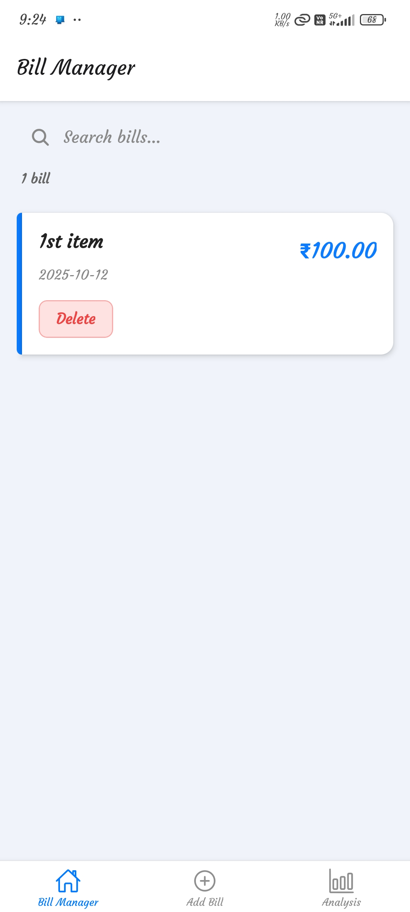
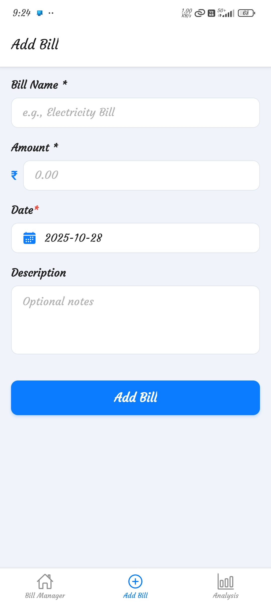
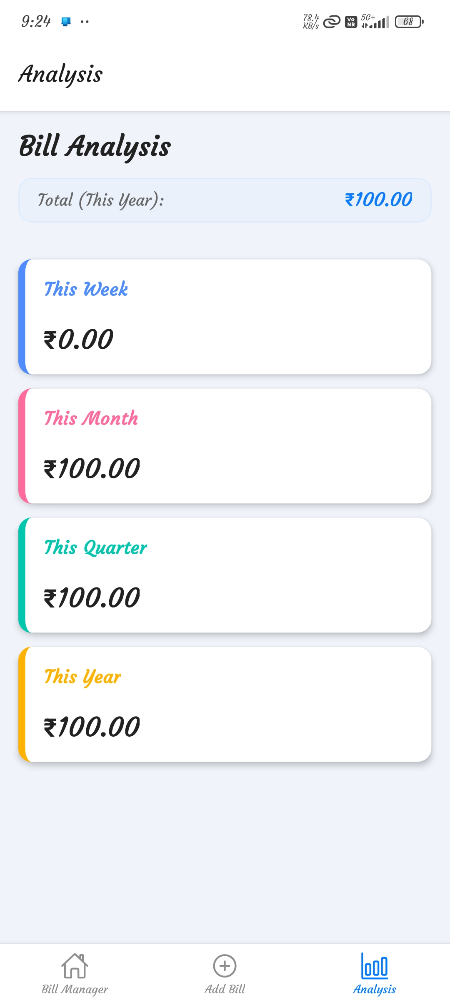

# Bill Manager (Expo)

A simple and elegant offline bill tracking app built with Expo + React Native using `expo-sqlite` for persistent storage.

Bill Manager is a mobile application built using **Expo + React Native** to help users track, manage, and analyze their daily expenses and bills. The app is lightweight, fast, and uses **`expo-sqlite`** for local offline data storage.

## App Screenshots

| Home Page                      | Add Item Page                         | Analysis Page                          |
| ------------------------------ | ------------------------------------- | -------------------------------------- |
|  |  |  |

## Features

* Quick Bill Entry – Add bills in seconds with a simple, distraction-free form
* Offline First – Uses `expo-sqlite` so your data stays on the device forever
* Smart Search – Instantly find past bills by name or date
* Detailed Insights – Weekly, Monthly, Quarterly, and Yearly totals
* Minimal & Clean UI – Designed for clarity and ease of daily use
* One-tap Delete – Manage bills without clutter or complexity


## Tech Stack

| Layer    | Technology                 |
| -------- | -------------------------- |
| Frontend | React Native (Expo)        |

| Database | expo-sqlite (local)        |


## Installation

```bash
# Clone repository
git clone https://github.com/Rudraksh121a/bill-manager-expo.git
cd bill-manager-expo

# Install dependencies
npm install

# Start the app
npx expo start
```

## How it Works

1. The app creates a local SQLite database on the device.
2. Each expense entry is stored locally.
3. Users can view analytics based on month or category.

## Roadmap

- [ ] Add recurring bill reminders
- [ ] Export data to CSV or PDF
- [ ] Cloud sync (optional)
- [ ] Custom categories and tags
- [ ] Dark mode support

## Contributing

Contributions are welcome! Please open issues or submit pull requests for new features, bug fixes, or improvements.

## License

This project is licensed under the [MIT License](LICENSE).

## Acknowledgements

- [Expo](https://expo.dev/)
- [React Native](https://reactnative.dev/)
- [expo-sqlite](https://docs.expo.dev/versions/latest/sdk/sqlite/)
