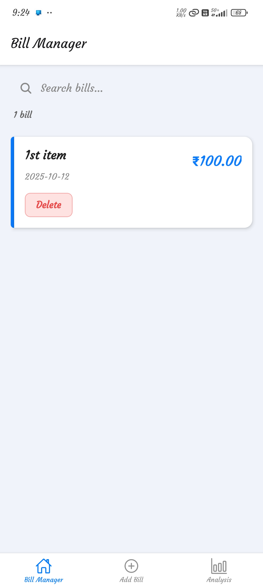
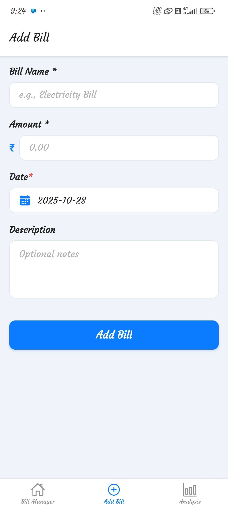
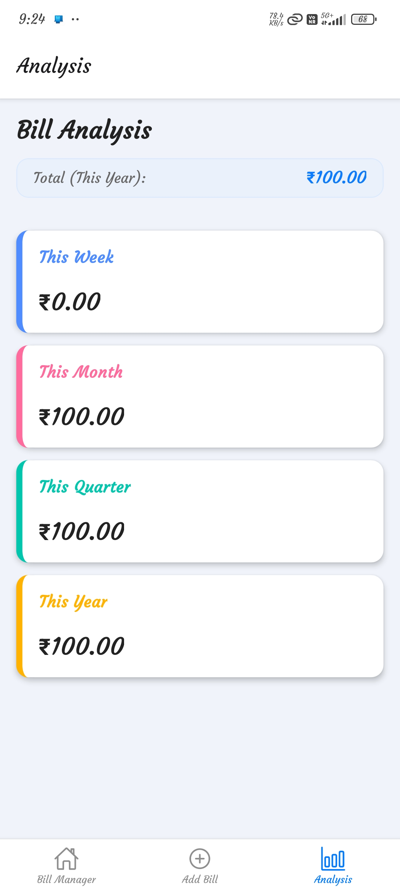

# Bill Manager (Expo)

A simple and elegant offline bill tracking app built with Expo + React Native using `expo-sqlite` for persistent storage.

Bill Manager is a mobile application built using **Expo + React Native** to help users track, manage, and analyze their daily expenses and bills. The app is lightweight, fast, and uses **`expo-sqlite`** for local offline data storage.

## App Screenshots

| Home Page                      | Add Item Page                         | Analysis Page                          |
| ------------------------------ | ------------------------------------- | -------------------------------------- |
|  |  |  |

## Features

- **Multi-Session Support** – Create separate sessions for different bill categories (Personal, Business, Family, etc.)
- **Quick Bill Entry** – Add bills in seconds with a simple, distraction-free form
- **Offline First** – Uses `expo-sqlite` so your data stays on the device forever
- **Smart Search** – Instantly find past bills by name or date
- **Detailed Insights** – Weekly, Monthly, Quarterly, and Yearly totals per session
- **Session Management** – Switch between sessions, view statistics, and manage bills independently
- **Minimal & Clean UI** – Designed for clarity and ease of daily use
- **One-tap Delete** – Manage bills without clutter or complexity

## Screenshots Preview

| Home                                           | Add Bill                                          | Analysis                                           |
| ---------------------------------------------- | ------------------------------------------------- | -------------------------------------------------- |
|  |  |  |

## Tech Stack

| Layer    | Technology          |
| -------- | ------------------- |
| Frontend | React Native (Expo) |

| Database | expo-sqlite (local) |

## Installation

```bash
# Clone repository
git clone https://github.com/Rudraksh121a/bill-manager-expo.git
cd bill-manager-expo

# Install dependencies
npm install

# Start the app
npx expo start
```

## How it Works

1. The app creates a local SQLite database on the device with support for multiple sessions.
2. Users can create different sessions for organizing bills (e.g., "Personal Bills", "Business Expenses", "Family Bills").
3. Each session maintains its own set of bills and analytics independently.
4. Users can switch between sessions and view session-specific statistics.
5. All data is stored locally and persists across app restarts.

## Multi-Session Feature

The app now supports creating multiple sessions to organize your bills independently:

### Creating Sessions

- Go to the **Sessions** tab to create new sessions
- Each session can have a name and description
- Example sessions: "Personal Bills", "Business Expenses", "Family Bills", "Travel Expenses"

### Session Management

- **Active Session**: Only one session is active at a time
- **Session Switching**: Easily switch between sessions using the session manager
- **Independent Data**: Each session maintains its own bills and analytics
- **Session Statistics**: View bill count and total amount for each session

### Session Features

- Create unlimited sessions
- Delete sessions (except the last remaining one)
- View detailed statistics per session
- Session-specific analytics and reports

## Roadmap

- [ ] Add recurring bill reminders
- [ ] Export data to CSV or PDF
- [ ] Cloud sync (optional)
- [ ] Custom categories and tags
- [ ] Dark mode support

## Contributing

Contributions are welcome! Please open issues or submit pull requests for new features, bug fixes, or improvements.

## License

This project is licensed under the [MIT License](LICENSE).

## Acknowledgements

- [Expo](https://expo.dev/)
- [React Native](https://reactnative.dev/)
- [expo-sqlite](https://docs.expo.dev/versions/latest/sdk/sqlite/)
